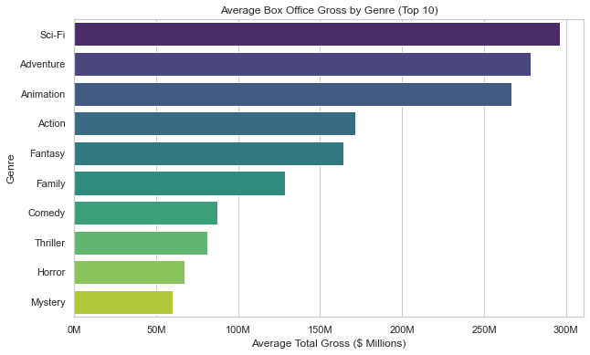
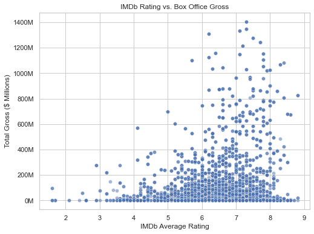
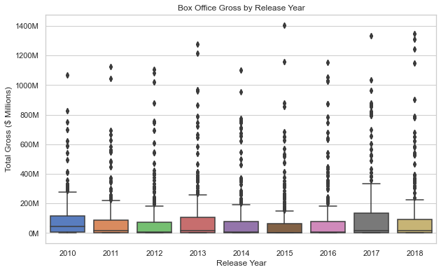

# Movie Studio Analysis Project

## Overview
This project leverages exploratory data analysis to guide the launch of a new movie studio by identifying high-performing film types. Using movie data from IMDb and Box Office Mojo, we analyze genres, ratings, runtime, and release timing to provide actionable insights for maximizing box office revenue.

## Business Understanding
**Stakeholder**: Head of the new movie studio.  
The company aims to enter the film industry amid a trend of original content creation by major players. Key business questions include:
- Which movie genres generate the highest gross revenue?
- How do factors like IMDb ratings, runtime, and release timing correlate with box office success?
- What actionable strategies can the studio adopt to ensure profitability?

This analysis translates data into three concrete recommendations to support strategic decision-making.

## Data Understanding and Analysis
### Source of Data
- **IMDb (im.db)**: A SQLite database containing `movie_basics` (titles, years, genres, runtime) and `movie_ratings` (average rating, votes), unzipped from `zippedData/im.db.zip`.
- **Box Office Mojo (bom.movie_gross.csv.gz)**: A compressed CSV file with movie titles, studios, domestic/foreign gross, and years, located in `zippedData/`.

### Description of Data
The datasets were merged on title and year (with a ±1 year tolerance), focusing on 2010–2018. Key steps included:
- Cleaning missing values (e.g., imputing runtime, handling gross NaNs).
- Exploding genres for individual analysis.
- Using SQL for aggregation, hypothesis testing for genre differences, and linear regression to model gross.

### Visualizations
1. **Average Box Office Gross by Genre**  
     
   Shows Sci-Fi ($296M) and Adventure ($279M) as top performers.

2. **Box Office Gross by Release Year**  
     
   Highlights higher gross potential in years like 2010 and 2015, likely due to summer releases.

3. **IMDb Rating vs. Box Office Gross**  
     
   Reveals a weak correlation (r=0.171), indicating ratings alone don’t drive gross.

These visuals are embedded in the Jupyter Notebook and presentation, supporting the recommendations.

## Conclusion
### Summary of Conclusions
- **Genre Performance**: Sci-Fi and Adventure lead with $296M and $279M average gross, while Action ($171M) significantly outperforms Drama ($38M, p < 0.0001).
- **Ratings and Runtime**: A weak positive correlation (r=0.171) exists between ratings and gross, with runtime adding $242K per minute in regression models.
- **Release Timing**: Higher gross in years like 2010 and 2015 suggests summer releases (June–August) drive success.

### Three Relevant Findings
1. **Prioritize Sci-Fi and Adventure Films**: These genres offer the highest revenue potential.
2. **Target Action Movies with 90-120 Minute Runtime**: Balances profitability and audience engagement.
3. **Release in Summer (June–August)**: Capitalizes on peak audience demand, as seen in historical data.

## Repository Contents
- `student.ipynb`: The main Jupyter Notebook with analysis and visualizations.
- `presentation.pdf`: The non-technical slide deck for stakeholders.
- `merged_movie_data.csv`: The cleaned, merged dataset for reference.
- `zippedData/`: Contains original data files (`im.db.zip`, `bom.movie_gross.csv.gz`).
- `visuals/`: Folder with PNGs of the three visualizations (if separated).

## How to Use
1. Clone the repository: `git clone https://github.com/antony-wala/dsc-phase-2-project-v3.git`.
2. Install dependencies: `pip install pandas sqlite3 matplotlib seaborn scipy scikit-learn`.
3. Run the notebook: Open `student.ipynb` in Jupyter and execute all cells.

## License
[Add license if applicable, e.g., MIT or check with your instructor.]
